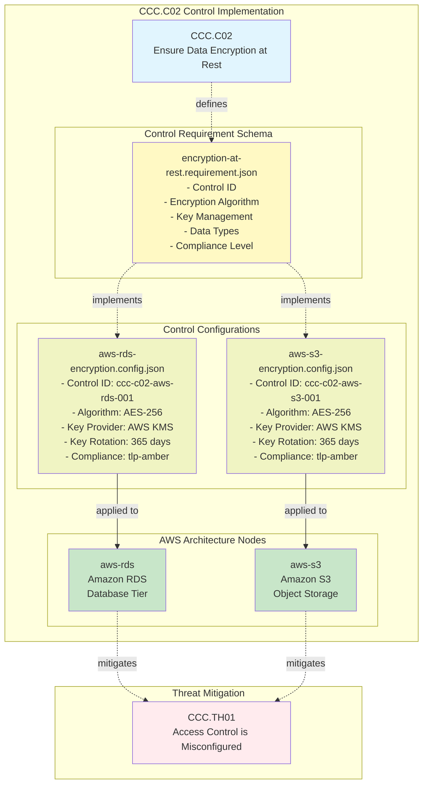

# CCC.C02 Implementation Summary

## Overview
This document summarizes the implementation of **CCC.C02 - Ensure Data Encryption at Rest for All Stored Data** as a CALM control requirement applied to the AWS three-tier web application architecture.

## Threat Mitigation
**Primary Threat:** CCC.TH01 - Access Control is Misconfigured

Even if access controls are misconfigured, encryption at rest ensures that data remains protected and unreadable without proper decryption keys.

## Control Implementation

### 1. Control Requirement Schema
**File:** `controls/encryption-at-rest.requirement.json`

Defines the structure and requirements for implementing encryption at rest controls:

- **Control ID**: Unique identifier for traceability
- **Encryption Algorithm**: Industry-standard algorithms (AES-256, AES-128, AES-256-GCM)
- **Key Management**: Configuration for key providers and rotation policies
- **Data Types**: Specifies which data types are encrypted (database, object-storage, etc.)
- **Compliance Level**: TLP classification (clear, green, amber, red)

### 2. Control Configurations

#### AWS RDS Configuration
**File:** `controls/aws-rds-encryption.config.json`
- **Control ID**: `ccc-c02-aws-rds-001`
- **Encryption**: AES-256 with AWS KMS
- **Key Rotation**: Enabled, 365-day period
- **Applies To**: Database storage
- **Compliance Level**: tlp-amber

#### AWS S3 Configuration
**File:** `controls/aws-s3-encryption.config.json`
- **Control ID**: `ccc-c02-aws-s3-001`
- **Encryption**: AES-256 with AWS KMS
- **Key Rotation**: Enabled, 365-day period
- **Applies To**: Object storage
- **Compliance Level**: tlp-amber

### 3. Architecture Application

Controls have been applied to the following nodes in `patterns/aws.calm.json`:

#### Amazon RDS (`aws-rds`)
```json
"controls": {
  "data-protection": {
    "description": "Data encryption at rest controls for Amazon RDS to mitigate CCC.TH01",
    "requirements": [
      {
        "control-requirement-url": "https://calm.finos.org/common-cloud-controls/three-tier-web-app/controls/encryption-at-rest.requirement.json",
        "control-config-url": "https://calm.finos.org/common-cloud-controls/three-tier-web-app/controls/aws-rds-encryption"
      }
    ]
  }
}
```

#### Amazon S3 (`aws-s3`)
```json
"controls": {
  "data-protection": {
    "description": "Data encryption at rest controls for Amazon S3 to mitigate CCC.TH01",
    "requirements": [
      {
        "control-requirement-url": "https://calm.finos.org/common-cloud-controls/three-tier-web-app/controls/encryption-at-rest.requirement.json",
        "control-config-url": "https://calm.finos.org/common-cloud-controls/three-tier-web-app/controls/aws-s3-encryption"
      }
    ]
  }
}
```

### 4. How the Controls Are Applied



## Assessment Requirements Met

### CCC.C02.TR01
✅ **When data is stored at rest, the service MUST be configured to encrypt data at rest using the latest industry-standard encryption methods.**

- Amazon RDS: Configured with AES-256 encryption via AWS KMS
- Amazon S3: Configured with AES-256 server-side encryption via AWS KMS

**Applicability:** tlp-clear, tlp-green, tlp-amber, tlp-red

## Key Management Details

Both services use **AWS Key Management Service (AWS KMS)** with:
- **Algorithm**: AES-256 (industry-standard)
- **Key Rotation**: Automatic, every 365 days
- **Key Provider**: AWS KMS (managed service)

## Compliance Mappings

This control implementation addresses:

- **NIST-CSF**: PR.DS-1 (Data-at-rest is protected)
- **CCM**: DSP-17 (Encryption & Key Management)
- **NIST 800-53**: SC-13 (Cryptographic Protection), SC-28 (Protection of Information at Rest)
