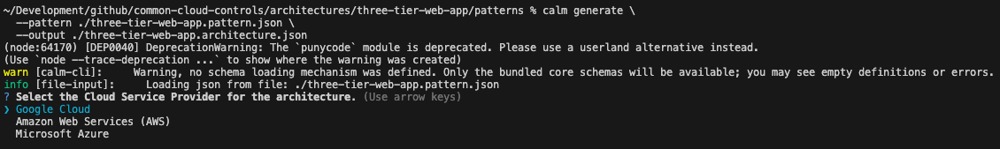
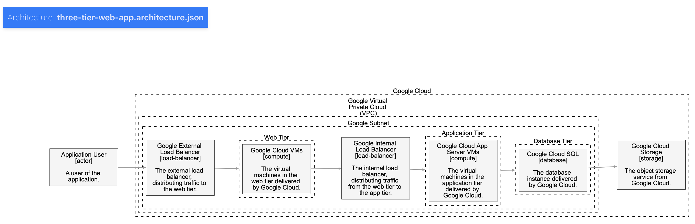
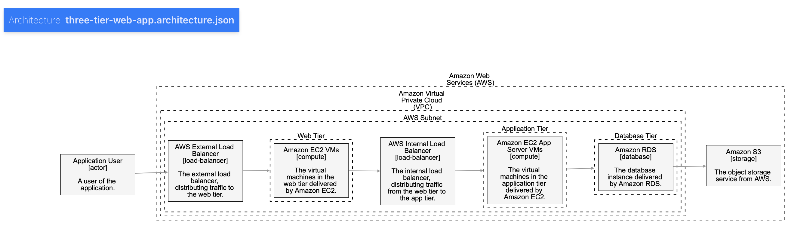
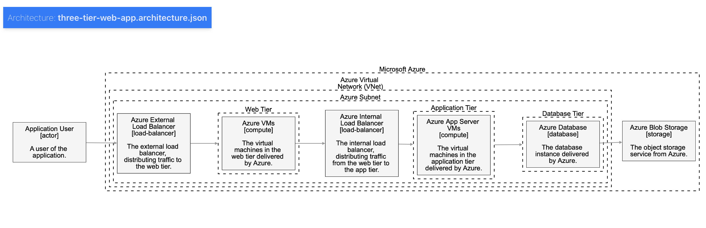

# Three-Tier Web Application CALM Pattern

This document provides an overview of the Common Architecture Language Model (CALM) and explains how it's used in this reference architecture. It also provides instructions for generating a concrete architecture from the provided CALM pattern using the CALM CLI.

## What is CALM?

**CALM** (Common Architecture Language Model) is a declarative, JSON-based modeling language for describing complex systems. It allows you to define the components of an architecture (nodes), the relationships between them, and the data flows that traverse the system.

Key features of CALM include:

- **Declarative and Versioned**: Architectures are defined in a declarative format and versioned using JSON Schema.
- **Component-Based**: Systems are modeled as a collection of nodes, relationships, and flows.
- **Extensible**: CALM can be extended with custom metadata to enrich the architectural model.

## Opinionated Reference Architecture

This project provides a CALM implementation of the Common Cloud Controls Three Tier Reference Architecture.

The pattern allows you to generate a concrete architecture for one of the following Cloud Service Providers (CSPs):

- Google Cloud
- Amazon Web Services (AWS)
- Microsoft Azure

The CALM CLI will then generate the CSP specific implementation.

## Generating an Architecture from the Pattern

To generate a concrete architecture from the CALM pattern, you can use the CALM CLI. The CLI provides a `generate` command that takes the pattern file as input and allows you to select from the available options.

### Prerequisites

Before you can generate an architecture, you need to have the CALM CLI installed. You can install it using npm:

```bash
npm install -g @finos/calm-cli
```

### Generating the Architecture

To generate the architecture, run the following command from the root of this directory:

```bash
calm generate \
  --pattern ./three-tier-web-app.pattern.json \
  --output ./three-tier-web-app.architecture.json 
```

This command will prompt you to select a CSP. 



Once you've made your selection, the CLI will generate a `three-tier-web-app.architecture.json` file in the same directory. This file represents the concrete architecture for the selected CSP.

Loading the architecture to [CALM Hub](https://github.com/finos/architecture-as-code/tree/main/calm-hub) allows you to visualise the architectures.

#### Google Cloud


#### Amazon Web Services


#### Microsoft Azure


### Where Next?
#### Controls
This example still needs to be linked to the `control requirements` which is how CALM enables architects to tie in non-functional requirements such as security and observability.

This could be done in a 'ligh-touch' mode where we could simply reference the CCC controls in their current form or we could create CCC specific schemas which would more tightly integrate into the CALM exosystem.

#### Automation
CALM provides the foundation for being able to build out ever more automation based on it's high fidelity architecture descriptions.

One of the extensions we've discussed but yet to be implemented, would be to provide 'skeleton' code for opinionated architectures that would enable users to bookstrap their entire application and infrastrcutre code from the architecture documents.