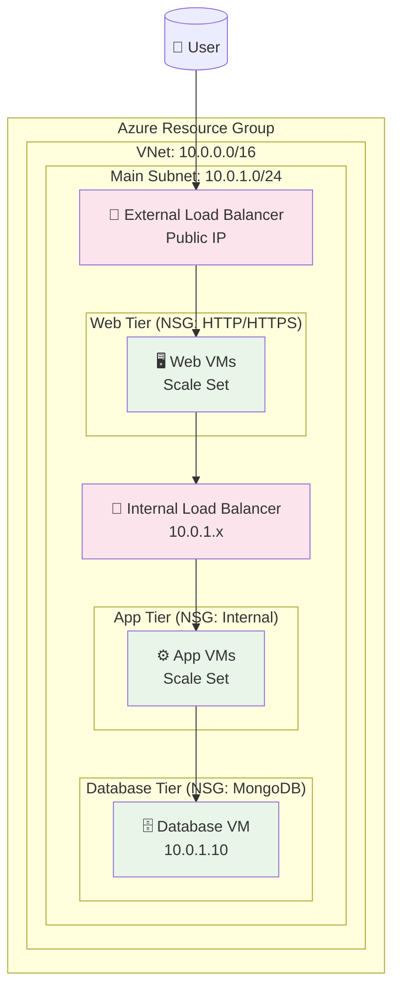

# Terraform Template Bundle for Three-Tier Web App

This template bundle generates Terraform infrastructure as code from CALM three-tier web application architecture models.

## Overview

This template bundle transforms CALM architecture models into production-ready Terraform configurations that can deploy three-tier web applications across multiple cloud providers (Azure, AWS, GCP).

## Template Structure

```
terraform-template-bundle/
├── index.json                     # Template bundle configuration
├── package.json                   # ES module configuration
├── infrastructure-transformer.js  # CALM model parser and transformer
├── main.tf.hbs                   # Main Terraform resources template
├── variables.tf.hbs              # Variable definitions template
├── outputs.tf.hbs                # Output values template
└── scripts/                      # VM startup scripts
    ├── web-startup.sh            # Web tier initialization
    ├── app-startup.sh            # Application tier initialization
    └── mongodb-startup.sh        # Database tier initialization
```

## Supported Architecture Patterns

- **Three-Tier Web Application**: Web tier (Nginx), Application tier (Node.js/Java/Python), Database tier (MongoDB)
- **Multi-Cloud Support**: Azure (fully implemented), AWS (planned), GCP (planned)
- **Load Balancing**: External load balancer for web tier, internal load balancer for app tier
- **Network Security**: Network security groups with tier-specific rules
- **Storage**: Blob storage for static assets and application data

## Usage

### Prerequisites

1. Install the CALM CLI
2. Have a CALM architecture model (e.g., `azure.json`)
3. Install Terraform
4. Configure cloud provider credentials

### Generate Infrastructure Code

```bash
# Using CALM CLI with template bundle (run from the patterns directory)
calm template \
  --architecture azure.json \
  --bundle ./terraform-template-bundle \
  --output ./generated-terraform

# Or with full paths from anywhere
calm template \
  --architecture /path/to/your/azure.json \
  --bundle /path/to/terraform-template-bundle \
  --output ./generated-terraform

# Navigate to generated directory and deploy
cd generated-terraform
terraform init
terraform plan
terraform apply
```

### Configuration

The template bundle automatically extracts configuration from your CALM model:

- **Project metadata**: Name, environment, owner
- **Infrastructure sizing**: VM sizes, instance counts
- **Networking**: VNet/VPC configuration, subnet layouts
- **Security**: Network security groups, firewall rules
- **Storage**: Account configuration, container setup

## Generated Resources

### Azure Resources

- **Resource Group**: Container for all resources
- **Virtual Network**: Network isolation with single subnet for all tiers
- **Network Security Groups**: Tier-specific security rules instead of subnet isolation
- **Load Balancers**: 
  - External Application Gateway with public IP for web tier
  - Internal Load Balancer for app tier communication
- **Virtual Machine Scale Sets**: Auto-scaling groups for web and app tiers
- **Virtual Machine**: Dedicated database server
- **Storage Account**: Blob storage for application assets
- **Public IP**: Internet access for the application

### Network Architecture

```
Internet
    ↓
[Public IP] → [External LB] → [Single Subnet: 10.0.1.0/24] 
                                  ├── [Web VMs]
                                  ├── [Internal LB] 
                                  ├── [App VMs]
                                  └── [DB VM]
```

## Customization

### Template Variables

The transformer extracts and sets these variables from your CALM model:

- `project_name`: Derived from metadata
- `environment`: dev/staging/prod
- `web_vm_count`: Number of web tier instances
- `app_vm_count`: Number of app tier instances
- `vm_sizes`: Instance sizing for each tier
- `location`: Deployment region

### Startup Scripts

Each tier includes customized startup scripts:

- **Web Tier**: Nginx reverse proxy configuration
- **App Tier**: Node.js application server with Express
- **Database Tier**: MongoDB installation and configuration

### Cloud Provider Support

Currently supported:
- ✅ **Azure**: Full implementation with ARM resources
- 🚧 **AWS**: Planned (EC2, VPC, ALB, RDS)
- 🚧 **GCP**: Planned (Compute Engine, VPC, Cloud Load Balancing)

## Example CALM Model

Your CALM architecture model should include nodes for:

```json
{
  "nodes": [
    {
      "unique_id": "webtier-azure-vms",
      "node_type": "web-server",
      "properties": {
        "instance_count": 2,
        "vm_size": "Standard_B2s"
      }
    },
    {
      "unique_id": "azure-app-server-vms", 
      "node_type": "application-server",
      "properties": {
        "instance_count": 2,
        "vm_size": "Standard_B2ms"
      }
    },
    {
      "unique_id": "azure-mongodb-vm",
      "node_type": "database",
      "properties": {
        "database_type": "mongodb",
        "vm_size": "Standard_D2s_v3"
      }
    }
  ]
}
```

## Output Information

After deployment, Terraform will output:

- Application URL (public IP)
- Load balancer endpoints
- Connection strings
- Resource identifiers
- Network configuration details

## Security Considerations

- SSH keys required for VM access
- Network security groups restrict access between tiers
- Database access limited to application subnet
- HTTPS configuration recommended for production

## Troubleshooting

### Common Issues

1. **SSH Key Missing**: Ensure `~/.ssh/id_rsa.pub` exists
2. **Region Capacity**: Try different Azure regions if deployment fails
3. **Quota Limits**: Check Azure subscription quotas for VMs and IPs

### Logs

Check VM startup logs:
- Web tier: `/var/log/web-startup.log`
- App tier: `/var/log/app-startup.log`  
- Database: `/var/log/mongodb-startup.log`

## Contributing

To extend this template bundle:

1. Modify `infrastructure-transformer.js` for new CALM model properties
2. Update Handlebars templates for additional resources
3. Add startup scripts for new application types
4. Test with sample CALM models

## License

This template bundle is provided under the same license as the Common Cloud Controls project.

